# Walla Walla University ENGR357 SDR Design Winter 2024

## Goals
- Continuous Coverage from 5-30 MHz and AM coverage (540-1700 kHz)
- Tune to AM by mixing up to 10.7 MHz then using the Tayloe detector to down-sample to 0-48 kHz

## Design
 - Incorporates a two stage mixing approach in order to achieve wider bandwidth with Si5351 quadrature limitations 
 - Utilizes a Tayloe detector for down-conversion of RF signals.
 - Optional second mixer to bring up AM frequencies (540-1700 kHz) so they can be sampled by Tayloe detector.
 - Input Stage: Automatic Band Pass Filters with optional AM mixer. Includes antenna ground isolation.
 - Output Stage: Quadrature signals amplified with 84 kHz low pass filter. Sampled directly with on-board ADC (48 kHz Nyquist) or output over 3.5mm audio jack. The larger LPF passband (84 kHz) minimizes ripple.
 - Raspberry Pi Pico W Controller with LDO (TPS7A8001DRBR) for cleaner +4V5 (derived from +5V USB).
 - H/W Controlled BPF multiplexors, i2c controlled 3-output VLO (Si5351), and i2s compatible ADC (PCM1808PWR).

## ltspice Simulations
Various core elements of the design were simulated to test their functionality. Notable simulations include a [Monte Carlo simulation](spice/BPF_monte_carlo.asc) of the three bandpass filters (frequency response shown below) to determine effects of component tolerances and a [simulation of the Tayloe detector](spice/Tayloe_test.asc), along with its "differential" amplifiers. The Tayloe detector input is a 1 $\mu V$ sinewave and the output (of the I channel) can be seen in the graph below. In the actual implementation, there is a 1 $\mu F$ blocking capacitor before the ADC and audio jack, but this is omitted for sake of simulation. This would remove the 2.25V DC offset.

Bandpass Filters
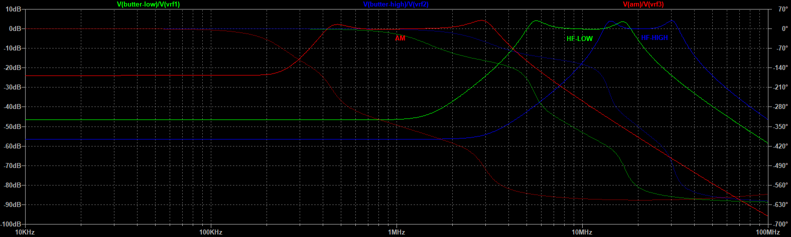

Tayloe Detector
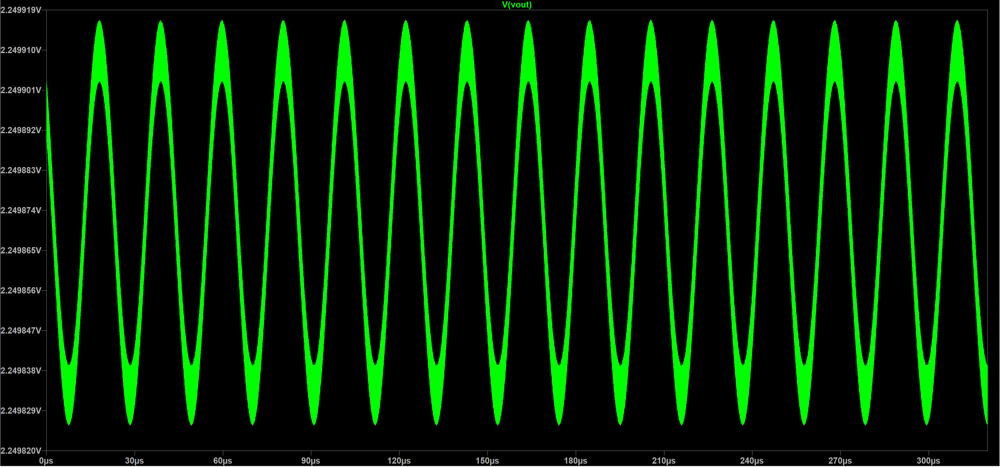

## Fabrication Information
The boards tested were fabricated by [JLCPCB](jlcpcb.com). They also installed all the surface-mount components--LCSC part numbers included in schematic. Total fabrication cost (including building the boards) from JLCPCB was about $120 USD for 5 boards. The [build plan](BuildPlan.md) was followed for assembling the boards and testing their functionality. The specifications for the inductors and transformer used, can be found in [Inductors](Inductors.md).

## Software
### Python
The software for the Raspberry Pi Pico W consists of three microPython files: [main.py](python/main.py), [radio.py](python/radio.py), and [si5351.py](python/si5351.py). All three files should be loaded onto the Pico.

The microPython module to control the SI5351, [si5351.py](python/si5351.py), was provided by [https://github.com/thaaraak/Tinypico-Radio/tree/master](https://github.com/thaaraak/Tinypico-Radio/tree/master). Some minor changes were made to the ```outputs_enabled``` setter in order to allow individual clock enabling/disabling--used for the AM mixer local oscillator.

The radio control is handled by [radio.py](python/radio.py) which after initializing a ```Radio```, ```run()``` can be used to parse Quisk commands and automatically control bandpass filter selection (based on frequency) and frequency. The bandpass filters can also be controlled manually by entering "BAND,AUTO" to allow for manual testing and use of the built in bypass capacitor. Frequencies from 4-32 MHz are handled via the HF HIGH/LOW BPFs with a single stage of mixing. Frequencies from 0.4-4 MHz are handled via AM mixing (due to the SI5351 not maintaining quadrature below 4 MHz). When switching from AM bands back to HF the SI5351 control is reinitialized to prevent unpredictable clock drift.

Currently there is no support for WiFi control/data transmit, nor is there support for the on-board ADC. This would require migrating to C for DMA. This is coming soon TM.

## Quisk
This SDR is designed to be used with Quisk (https://james.ahlstrom.name/quisk/). Some basic Quisk device configs are provided in [quisk](quisk/). Currently there is no custom widget support for bandpass selection and AM offsets (for tuning away from center).

An optional [Dockerfile](Dockerfile) and sample [start script](startDocker.sh.sample) is provided to run Quisk via Docker--though this requires proper ```/dev/ttyACM0``` permissions, pulseaudio, and xserver. If running on Windows via WSL the aforementioned packages should be installed as well as utilizing usbipd-win (https://james.ahlstrom.name/quisk/) to passthrough the Pico connection.

## Case
stl files for a 3d printable [case](case) are included. Note that because the board does not have any mounting holes the case is a friction fit--consider adjusting tolerances when printing.

## Testing
Testing revealed the radio functions over the planned 10-30 MHz as well as the AM commercial frequencies (using the second mixer), though some signal overlap is apparent for AM. The bandpass filters were characterized using a signal generator and a spectrum analyzer.

### AM Bandpass Filter Characterization
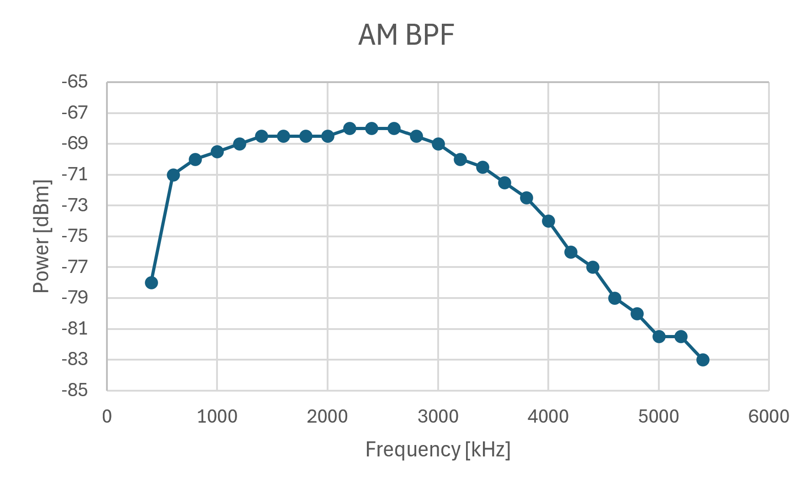

### Low HF Bandpass Filter Characterization
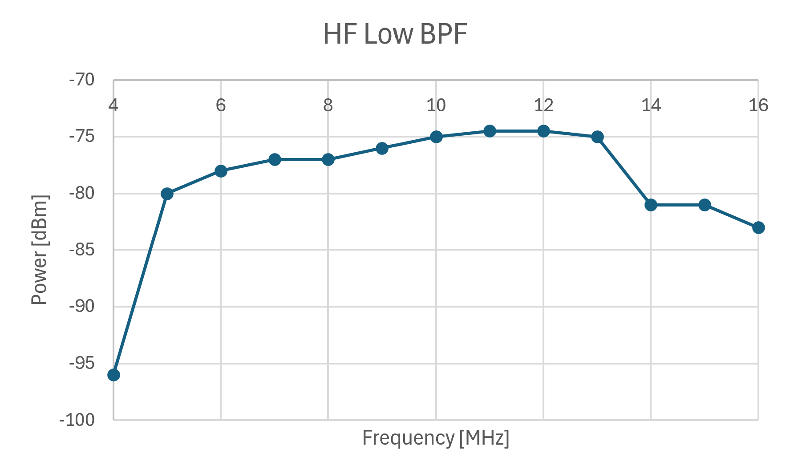

### High HF Bandpass Filter Characterization
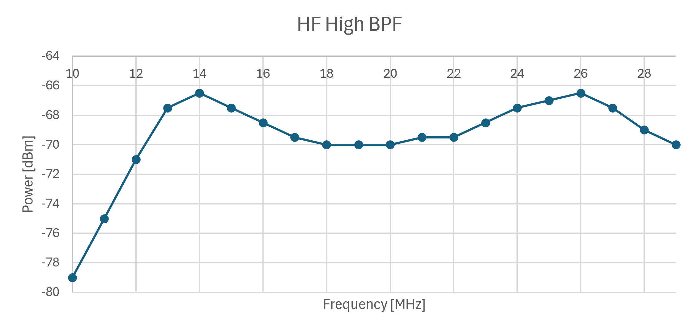

## KiCAD Schematic
### Complete Block Diagram
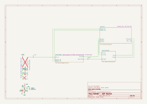

### Automatic Band Pass Filter
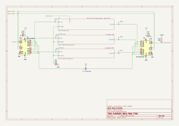

### AM Handling: Filters and Upconversion
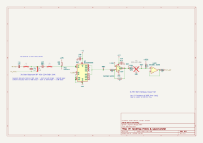

### 3rd Order Butterworth BPF 5-18 MHz
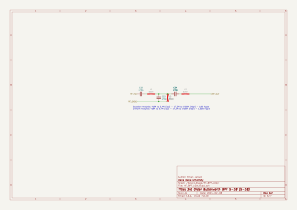

### 3rd Order Butterworth BPF 13-32.7 MHz
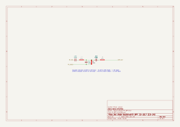

### IQ Tayloe Detector & 84kHz IF filter
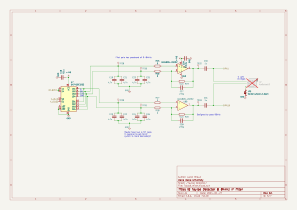

### SDR Controller
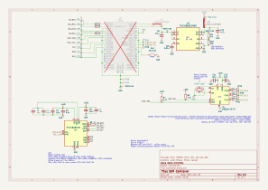